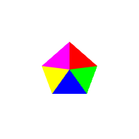
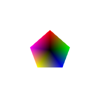

# WebGL-2.0

This is an outline of the ["WebGL 2.0" videos by Andrew Adamson](https://www.youtube.com/playlist?list=PLPbmjY2NVO_X1U1JzLxLDdRn4NmtxyQQo)

[See all chapters](https://github.com/evpozdniakov/WebGL-2.0/blob/main/README.md)

## 06.Element Arrays & drawElements()

WebGL provides **five different functions** to draw geometry on the canvas:

- `gl.drawArrays()`
- `gl.drawElements()`
- `gl.drawArraysInstanced()`
- `gl.drawElementsInstanced()`
- `gl.drawRangeElements()`

So far, we've only used the first one — `gl.drawArrays()`. In this chapter, we'll focus on the second function, `gl.drawElements()` — how it works, how to use it, and what advantages (and limitations) it has compared to `drawArrays()`.

### Drawing a pentagon

We'll start by drawing five triangles (forming a pentagon) the old way, and then modify our code to use gl.drawElements().

#### Using `gl.drawArrays()`

The code below defines five triangles (a pentagon), stores their coordinates in a buffer, and draws 15 vertices.

```js
const arrayVertexData = new Float32Array([
  0, 0,      0,     0.4,       0.4,   0.05,
  0, 0,      0.4,   0.05,      0.25, -0.35,
  0, 0,      0.25, -0.35,     -0.25, -0.35,
  0, 0,     -0.25, -0.35,     -0.4,   0.05,
  0, 0,     -0.4,   0.05,      0,     0.4,
]);

const arrayVertexBuffer = gl.createBuffer();
gl.bindBuffer(gl.ARRAY_BUFFER, arrayVertexBuffer);
gl.bufferData(gl.ARRAY_BUFFER, arrayVertexData, gl.STATIC_DRAW);
gl.vertexAttribPointer(aCoordsLocation, 2, gl.FLOAT, false, 8, 0);
gl.enableVertexAttribArray(aCoordsLocation);

gl.drawArrays(gl.TRIANGLES, 0, 15);
```

If you look closely, the `coordsData` array contains some duplicate values:

- The coordinate `0, 0` is used **five times**.
- Every other coordinate is used **twice**.

Can we avoid this repetition and make our buffer smaller?

That’s exactly what the method **`gl.drawElements()`** is designed for.

#### Using `gl.drawElements()`

Here is how we do the same in a new way.

```js
// array of unique coords
const elementVertexData = new Float32Array([
  0,     0,       // pentagon center coord, index 0
  0,     0.4,     // top apex coord, index 1
  0.4,   0.05,    // middle right apex coord, index 2
  0.25, -0.35,    // bottom right apex coord, index 4
  -0.25, -0.35,   // bottom left apex coord, index 4
  -0.4,   0.05,   // middle left apex coord, index 5
]);

// array of 5 triangles coord indices
const elementIndexData = new Uint8Array([
  0, 1, 2, // top right
  0, 2, 3, // bottom right
  0, 3, 4, // bottom
  0, 4, 5, // bottom left
  0, 5, 1, // top left
]);

// unique coords buffer
const elementVertexBuffer = gl.createBuffer();
gl.bindBuffer(gl.ARRAY_BUFFER, elementVertexBuffer);
gl.bufferData(gl.ARRAY_BUFFER, elementVertexData, gl.STATIC_DRAW);

// indices buffer (bound to `gl.ELEMENT_ARRAY_BUFFER`)
const elementIndexBuffer = gl.createBuffer();
gl.bindBuffer(gl.ELEMENT_ARRAY_BUFFER, elementIndexBuffer);
gl.bufferData(gl.ELEMENT_ARRAY_BUFFER, elementIndexData, gl.STATIC_DRAW);

// coords data are linked to the attribute the same way
gl.vertexAttribPointer(aCoordsLocation, 2, gl.FLOAT, false, 8, 0);
gl.enableVertexAttribArray(aCoordsLocation);

// draw call with `gl.drawElements()` that takes 4 parameters
gl.drawElements(
  gl.TRIANGLES,     // mode
  15,               // count - how many vertices to draw
  gl.UNSIGNED_BYTE, // type - element indices data type
  0,                // offset
);
```

#### Preliminary comparison

In the **first version**, we have a single vertex data buffer of **120 bytes**.

In the **second version**, we have:
- a vertex data buffer of **48 bytes**, and  
- an index data buffer of **15 bytes**,  

for a total of **63 bytes** — almost **half the size** of the original.

### Drawing a colored pentagon

This time we want to paint each triangle in its own color.

We can achive the goal with `gl.drawArrays()`.



But unfortunately we cannot do the same with `gl.drawElements()`.



### Conclusion

If you are lucky and your data is simple and highly repetitive, then `gl.drawElements()` is defenitely a function that you wants to use.

See the [Element Arrays in action](https://evpozdniakov.github.io/WebGL-2.0/06.Element%20Arrays%20&%20drawElements()/index.html) and check the [source files](https://github.com/evpozdniakov/WebGL-2.0/tree/main/06.Element%20Arrays%20&%20drawElements()).
