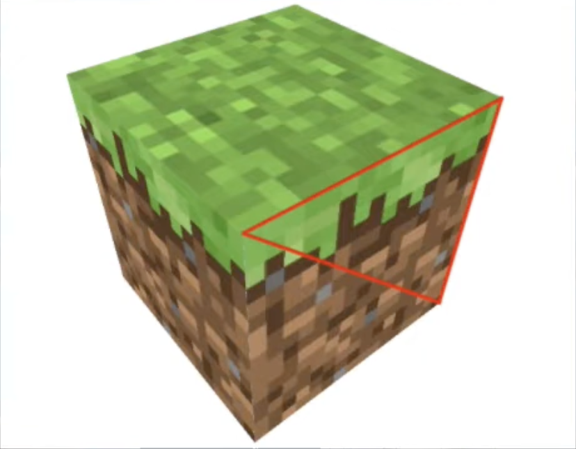
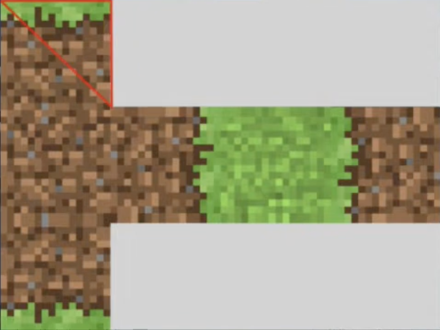

# WebGL-2.0

This is an outline of the ["WebGL 2.0" videos by Andrew Adamson](https://www.youtube.com/playlist?list=PLPbmjY2NVO_X1U1JzLxLDdRn4NmtxyQQo)

[See all chapters](https://github.com/evpozdniakov/WebGL-2.0/blob/main/README.md)

## 08.Textures (Part 1)

Textures can't be applied to **points** or **lines** — they require a **triangle**. (If you have a square shape, you'll need to apply the texture to the two triangles that form the square.)

We are going to build two examples: one with a single texture and another with two. (If you want to follow the instructions, you can use the triangle drawing example from [this page](https://evpozdniakov.github.io/WebGL-2.0/04.Attributes/index.html) as a starting point.)

### Texture basic exmple

To render a texture we need to modify our code in both the `GLSL` and in `JS` parts. Let's start with the shaders.

#### Setting up shaders

Both shaders require minor adjustments. In the **vertex shader**, we need to receive **texture coordinates** for each vertex and pass them to the **fragment shader**. What texture coordinates are and how they're used will be explained later.

```GLSL
// vertex shader
...
layout(location = 3) in mediump vec2 aTexCoords;
out mediump vec2 vTexCoords;

void main()
{
  ...
  vTexCoords = aTexCoords;
}
```

In the **fragment shader** we use the texture coordinates and pass them into a built-in `texture()` function along with a `sampler2D` uniform. The `texture()` function returns the sampled color as a `vec4`, which we assign to `fragColor` — the shader's output.

```GLSL
// fragment shader
...
// remove `mediump` if you set up the default precision value
in mediump vec2 vTexCoords;
uniform sampler2D uSampler;

void main()
{
  // this is the only line we need in `main` function
  fragColor = texture(uSampler, vTexCoords);
}
```

#### Texture coordinates

A **texture coordinate** is a pair of decimal values in the range **0.0–1.0**. They describe a point on the texture image — similar to **x** and **y** on a 2D plane — but by convention they are called **u** and **v**.  

A **texture image** is always a flat 2D surface. This is why just two coordinates (**u** and **v**) are sufficient to describe any point on it.  It almost feels like magic that such a flat image can be wrapped around and painted onto 3D objects like spheres.

To apply a texture to a cube, we need to assign texture coordinates to each vertex of all 12 triangles that make up the cube.

<div style="display:flex;gap:1em;max-width:500px;">
  
  
</div>
<br>

How do we calculate **u** and **v** for the triangle in the example above? It's not difficult.

The **bottom-left corner** of the texture has coordinates `u = 0, v = 0` — it's placed at the origin of the texture space. The **top-right corner** has coordinates `u = 1, v = 1`.

So, our triangle has the following texture coordinates:

- `0, 1` (left top corner)
- `1/4, 1` (right top corer)
- `1/4, 2/3` (right bottom corner)

#### Setting up texture coordinates

To calculate texture coordinates, we need to convert the **x** and **y** coordinates in canvas space to **u** and **v** coordinates in texture space. Keep in mind that canvas space spans from -1.0 to 1.0, whereas texture space spans from 0.0 to 1.0.

Let's find texture coordinates for our triangle vertices.

| vertex coord | texture coord |
|:------------:|:-------------:|
| -1, -1       | 0, 0          |
| 0, 1         | 0.5, 1        |
| 1, -1        | 1, 0          |

And use them.

```js
const aTexCoordsLocation = 3;
const texBufferData = new Float32Array([
  0, 0,
  0.5, 1,
  1, 0,
]);
const texBuffer = gl.createBuffer();
gl.bindBuffer(gl.ARRAY_BUFFER, texBuffer);
gl.bufferData(gl.ARRAY_BUFFER, texBufferData, gl.STATIC_DRAW);
gl.enableVertexAttribArray(aTexCoordsLocation);
gl.vertexAttribPointer(aTexCoordsLocation, 2, gl.FLOAT, false, 8, 0);
```

All is missing now is the texture itself.

#### Setting up texture

For our basic example we use a 4x4 pixels matrix with hardcoded random RGB values.

```js
const pixels = new Uint8Array([
  255,255,255,       230,25,75,        60,180,75,        255,225,25,
  67,99,216,         245,130,49,       145,30,180,       70,240,240,
  240,50,230,        188,246,12,       250,190,190,      0,128,128,
  230,190,255,       154,99,36,        255,250,200,      0,0,0,
]);
```

Then we create a WebGL texture object and pass the pixels into it.

```js
const texture = gl.createTexture();
gl.bindTexture(gl.TEXTURE_2D, texture);
gl.texImage2D(
  gl.TEXTURE_2D,    // target
  0,                // mipmap level (will be explained in the next chapter)
  gl.RGB,           // internal format
  4,                // width
  4,                // height
  0,                // border (must be 0)
  gl.RGB,           // texture format
  gl.UNSIGNED_BYTE, // type (size of each element in texture data)
  pixels,
);
```

The three parameters of `texImage2D()` — **internalFormat**, **format**, and **type** — must be compatible with each other. You can find more details on the [method's MDN page](https://developer.mozilla.org/en-US/docs/Web/API/WebGLRenderingContext/texImage2D).

By default, WebGL expects textures to use **mipmaps**. The `generateMipmap()` method creates them for you automatically. (We’ll discuss mipmaps in the next chapter.)

```js
gl.generateMipmap(gl.TEXTURE_2D);
```

This concludes our basic example. In the advanced one, we’ll use an **image** as a texture, explain **texture units**, and explore several **texture parameters**.

### Texture advanced example

Let’s add one more texture to our triangle and blend it with the existing one —  this time using an **image file** as the source. But first we need some theory.

#### Texture units

To use a texture in a WebGL program, we need to make it available to the GPU. The GPU has a limited number of **texture slots** in its internal state. Each slot holds a **texture binding** — a link to a texture object stored somewhere in the GPU’s memory. Therefore, every texture must be linked to one of these slots.

This linkage is managed through **texture units**. A **texture unit** is simply an index that refers to one of the GPU’s texture slots.

In the basic example, we used only one texture. We declared a uniform of type `sampler2D` to hold the texture unit. We didn’t set a value for it, but it still worked because it received the default value `0`.

In the advanced example, we use **two textures**, therefore we need **two texture units**. It’s up to us to choose their index values, but we must also keep in mind hardware limitations — we can’t exceed the maximum number of supported texture units.

You can check these limits with the following commands:

```js
// The total number of texture units available across all shaders
gl.getParameter(gl.MAX_COMBINED_TEXTURE_IMAGE_UNITS);

// The number of texture units available for a single shader
gl.getParameter(gl.MAX_TEXTURE_IMAGE_UNITS);
```

WebGL guarantees at least **16 texture units** for each shader, so we’re free to use indices in the range **0–15**.

#### Setting up shaders

Our vertex shader doesn't require any changes. In our fragment shader we add one more `sampler2D` and we blend two textures.

```GLSL
// fragment shader
...
uniform sampler2D uPixelSampler; // renamed (used to be `uSampler`)
uniform sampler2D uKittenSampler;

void main()
{
  // the code below will multiply colors of two textures to blend them
  fragColor = texture(uPixelSampler, vTexCoords) * texture(uKittenSampler, vTexCoords);
}
```

#### Setting up texture units

The code below configures the texture units. It needs to be executed before `gl.bindTexture()`.

```js
// setting up texture unit indices
const pixelTextureUnit = 0;
const kittenTextureUnit = 5;

// providing indices to shaders
const uPixelSamplerLocation = gl.getUniformLocation(program, 'uPixelSampler');
gl.uniform1i(uPixelSamplerLocation, pixelTextureUnit);
const uKittenSamplerLocation = gl.getUniformLocation(program, 'uKittenSampler');
gl.uniform1i(uKittenSamplerLocation, kittenTextureUnit);
```

Since we want to use multiple textures, we need to activate them. To activate a texture we need to use `gl.TEXTURE0` — a constant defined by WebGL that corresponds to the first texture unit.

You need to place `gl.activeTexture()` before you bind the texture.

```js
// activating pixels texture
gl.activeTexture(gl.TEXTURE0 + pixelTextureUnit);
gl.bindTexture(gl.TEXTURE_2D, texture);
// the other texture is activated in the next code block
```

Loading an image is an *asynchronous process*. We need to make our code asynchronous to make it work.

```js
const loadImage = () => new Promise((resolve) => {
  const img = new Image();
  img.addEventListener('load', () => resolve(img));
  img.crossOrigin = 'unonimous'; // this line isn't needed if you use local server
  img.src = 'https://raw.githubusercontent.com/evpozdniakov/WebGL-2.0/refs/heads/main/08.Textures%20(Part%201)/kitten.jpeg';
});

const run = async () => {
  const htmlImage = await loadImage();
  const texture = gl.createTexture();
  gl.activeTexture(gl.TEXTURE0 + kittenTextureUnit);
  gl.bindTexture(gl.TEXTURE_2D, texture);
  gl.texImage2D(
    gl.TEXTURE_2D,    // target
    0,                // mipmap level (will be explained in the next chapter)
    gl.RGB,           // internal format
    259,              // width
    194,              // height
    0,                // border (must be 0)
    gl.RGB,           // texture format
    gl.UNSIGNED_BYTE, // type (size of each element in texture data)
    htmlImage,
  );
  gl.generateMipmap(gl.TEXTURE_2D);

  // We have to move the draw call inside our async function.
  gl.drawArrays(gl.TRIANGLES, 0, 3);
};

run();
```

### Usefule settings

#### Flipping texture

You may notice that our image is displayed upside down. This happens because WebGL and most image formats use **different coordinate systems** — in WebGL, the texture’s vertical axis (`v`) starts at the **bottom**, while in most image files, it starts at the **top**.

To fix this, we can tell WebGL to flip the image vertically before uploading it to the GPU:

```js
// Must be called before gl.texImage2D()
gl.pixelStorei(gl.UNPACK_FLIP_Y_WEBGL, true);
```

#### Minification and magnification

When a texture is drawn larger or smaller than its original size, WebGL needs to decide **how to sample its pixels**. This behavior is controlled by two parameters:

- `gl.TEXTURE_MIN_FILTER`
- `gl.TEXTURE_MAG_FILTER`

You can configure them using the `gl.texParameteri()` function, for example:

```js
gl.texParameteri(gl.TEXTURE_2D, gl.TEXTURE_MIN_FILTER, gl.NEAREST);
gl.texParameteri(gl.TEXTURE_2D, gl.TEXTURE_MAG_FILTER, gl.LINEAR);
```

Common values are `gl.NEAREST` (nearest-neighbor sampling for a sharp, pixelated look) and `gl.LINEAR` (smooth interpolation between pixels).
